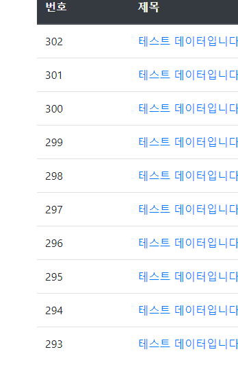

# CHAPTER 3 - 1

분량이 많아져서 주차별로 나누지 않고 챕터별로 (챕터 안에서도 구분) 정리할 예정 

## 3-1. 네비게이션 기능 추가하기 
* FE 내용 대부분 
* include 기능 사용하여 유지 보수가 쉽게 따로 파일로 만들어줄 수 있음 
* 네비게이션 기능을 추가하였다 

## 3-2. 게시판 페이징 기능 추가하기 
* 페이징 기능 필요한 이유: 데이터들이 너무 많아지면 (게시글이 너무 많아지면) 페이지가 한없이 길어지므로 페이징으로 나눠주자 
```python
@bp.route('/list/')
def _list():
    page = request.args.get('page', type=int, default=1) #페이지
    question_list=Question.query.order_by(Question.create_date.desc())
    question_list = question_list.paginate(page=page, per_page=10) #페이징 적용 :paginate 함수 -> 조회한 데이터를 감싸 Pagination 객체로 감쌈 , page=page 라고 해야 매개변수 에러 발생 안함 
    return render_template('question/question_list.html', question_list=question_list)
```


## 3-3. 템플릿 필터 직접 만들어보기 
* datetime 객체를 보기 편한 문자열로 만드는 템플릿 필터 만들기 
    ```python
    def format_datetime(value, fmt='%Y년 %m월 %d일 %H:%M'):
    return value.strftime(fmt)
    ```
    * pybo/filter.py를 생성하여 value로 전달받은 datetime 객체를 2번째 맥변수의 날짜형식으로 변환 
    
    ```python
    #필터 
    from .filter import format_datetime
    app.jinja_env.filters['datetime']=format_datetime 
    ```
    * datetime이라는 이름으로 필터를 `__init__.py` 파일에 create_app() 안에 등록시킴 
    ```html
    <td>{{question.create_date|datetime}}</td>
    ```
    * 파이프라인을 사용하여 datetime 필터를 적용시킴 
    

## 3-4. 게시물에 일련번호 추가하기 
* 페이지마다 게시물 번호가 1부터 시작하는 문제를 해결 
    * 1페이지도 1부터, 2페이지도 1부터.. 
* 질문 게시물의 번호 역순 정렬 공식 
    ```
    번호=전체 게시물 개수 - (현재페이지 -1)*페이지당 게시물 개수 - 나열 인덱스
    ```
    ```html
    <td>{{question_list.total - ((question_list.page-1)*question_list.per_page)-loop.index0}}</td>
    ```
    

## 3-5. 질문에 달린 답변 개수 표시하기 
```html
<td>
    <a href="{{url_for('question.detail',question_id=question.id)}}">{{question.subject}}</a>
    
    <span class="text-danger small ml-2">{{question.answer_set|length}}</span>
    
</td>
```
* 해당 질문에 달린 답변 개수 표시 


## 3-6. 회원가입 기능 추가하기 
### 회원정보를 위한 모델 작성하기
```python
class User(db.Model):
    id=db.Column(db.Integer, primary_key=True)
    username=db.Column(db.String(150), unique=True, nullable=False)
    password= db.Column(db.String(200), nullable=False)
    email=db.Column(db.String(120), unique=True, nullable=False)
```
* `unique=True` : 같은 값을 저장할 수 없다 (중복 방지)
### 회원가입 폼 만들기
* FlaskForm 을 상속받아 User CreateForm 클래스 만들기
```python
class UserCreateForm(FlaskForm):
    username=StringField('사용자이름', validators=[DataRequired(), Length(min=3, max=25)])
    password1=PasswordField('비밀번호', validators=[DataRequired(), EqualTo('password2','비밀번호가 일치하지 않습니다')])
    password2=PasswordField('비밀번호확인', validators=[DataRequired()])
    email=EmailField('이메일', [DataRequired(), Email()])
```
* email 필드에 설정한 이메일 검증 사용하기 위해 email-validator 설치 필요 (pip install email_validator 통해 install합시다)
### 회원가입 화면 만들기 
```python
from flask import Blueprint, url_for, render_template, flash, request
from werkzeug.security import generate_password_hash
from werkzeug.utils import redirect

from pybo import db
from pybo.forms import UserCreateForm
from pybo.models import User

bp=Blueprint('auth',__name__,url_prefix='/auth')

@bp.route('/signup/',methods=('GET','POST'))
def signup():
    form=UserCreateForm()
    if request.method=='POST' and form.validate_on_submit(): #POST 요청 방식에는 계정등록
        user=User.query.filter_by(username=form.username.data).first()
        if not user:
            user=User(username=form.username.data, password=generate_password_hash(form.password1.data),email=form.email.data)
            db.session.add(user)
            db.session.commit()
            return redirect(url_for('main.index'))
        else:
            flash('이미 존재하는 사용자입니다.')
    return render_template('auth/signup.html',form=form)
```
* generate_password_hash()로 비밀번호를 그냥 저장하지 않고 암호화하여 저장 
* 구체적인 구현 방식은 질문 등록 과정과 똑같음 

* 다음으로 `pybo/__init__.py` 파일에 블루프린트 등록을 해야함 
* forms.py 파일에서 def UserCreateForm() 함수 구현 부분에서 에러 발생 
    * **에러발생**
        * *[python] Cannot find reference 'xxx' in __init__.py - Python / Pycharm*
        * 참고링크: https://syntaxfix.com/question/9358/cannot-find-reference-xxx-in-init-py-python-pycharm 
        * 해결: `from wtforms.fields import EmailField` 로 바꿈 
