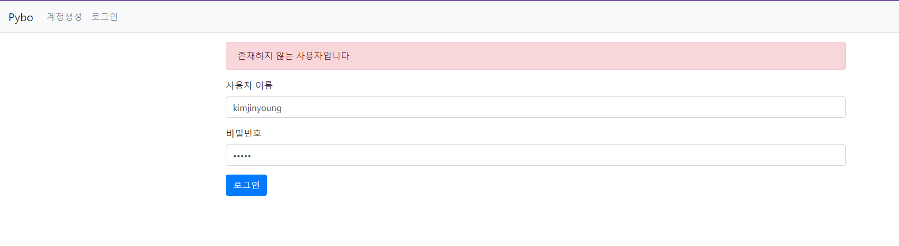
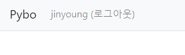
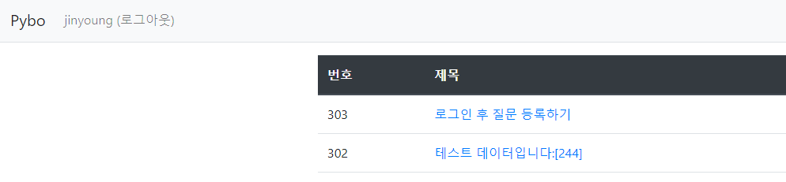
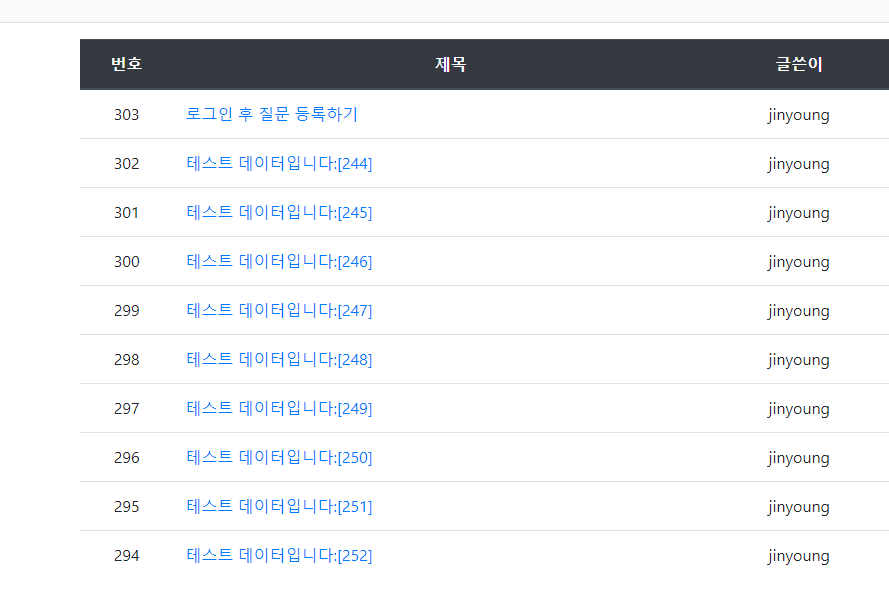
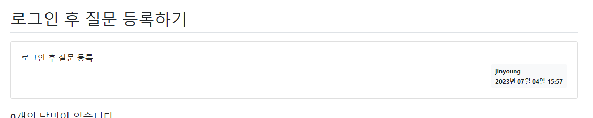
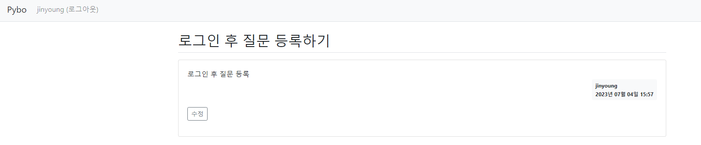
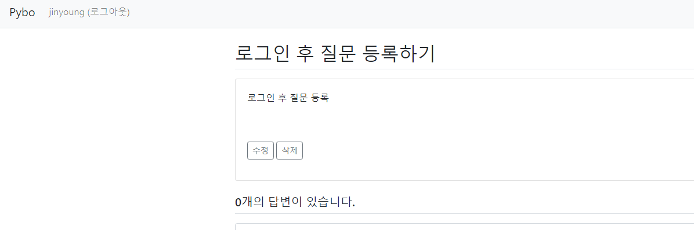
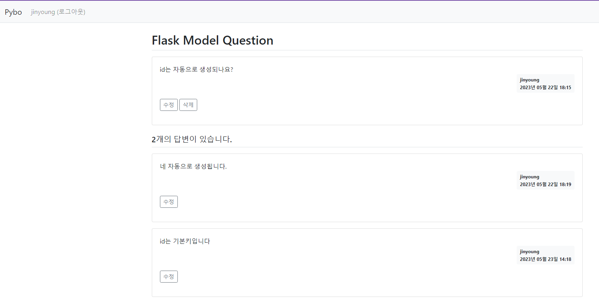

# CHAPTER 3 - 2

## 3-7. 로그인과 로그아웃 구현하기 
```python
class UserLoginForm(FlaskForm):
    username=StringField('사용자이름', validators=[DataRequired(), Length(min=3, max=25)])
    password=PasswordField('비밀번호', validators=[DataRequired()]) 
```
* FlaskForm 클래스를 상속받아 UserLoginForm 만듬 
* username은 3~25자로 제한 
```python
@bp.route('/login/', methods=('GET','POST'))
def login():
    form = UserLoginForm()
    if request.method =='POST' and form.validate_on_submit():
        error=None
        user=User.query.filter_by(username=form.username.data).first()
        if not user:
            error="존재하지 않는 사용자입니다"
        elif not check_password_hash(user.password, form.password.data):
            error="비밀번호가 올바르지 않습니다."
        if error is None:
            session.clear()
            session['user_id']=user.id #플라스크 세션에 키와 키값 저장 
            return redirect(url_for('main.index'))
        flash(error)
    return render_template('auth/login.html', form=form)
```
* `POST` 방식 요청에는 로그인 수행
* `GET` 방식 요청에는 로그인 템플릿 렌더링 
* 세션? 
    * 플라스크 서버를 구동하는 동안에 영구히 참조할 수 있는 값 
    * 쿠키 1개당 생성되는 서버의 메모리 공간 
* 쿠키: 웹 브라우저를 구별하는 값 


```python
@bp.before_app_request # 이 어노테이션이 적용된 함수는 라우트 함수보다 먼저 실행됨
def load_logged_in_user():
    user_id=session.get('user_id')
    if user_id is None: # session 변수에 user_id 값이 있으면 데이터베이스에서 이를 조회하여 g.user에 저장
        g.user=None # g는 플라스크가 제공하는 컨텍스트 변수 (요청 -> 응답 과정에서 유효함)
    else:
        g.user=User.query.get(user_id)
```
* 이후 사용자 로그인 검사를 할때 session을 조사할 필요 없이 g.user에 값이 있는지만 알아내면 됨 

```python
@bp.route('/logout/')
def logout():
    session.clear() #세션의 모든 값 삭제 -> session에 저장된 user_id 삭제되고 g.user가 None이 됨 
    return redirect(url_for('main.index'))
```
* 로그아웃 기능 구현 



## 3-8. 모델 수정하여 파이보 기능 다듬기 
```python
    user_id=db.Column(db.Integer, db.ForeignKey('user.id',ondelete='CASCADE'),nullable=False)
    user=db.relationship('User',backref=db.backref('question_set'))
```


* 로그아웃 후 질문을 등록하면 에러가 발생 : g.user의 값이 None이기 때문 -> 해결: 로그아웃 상태에서 등록 시 로그인 페이지로 리다이렉트 시키자 
```python
def login_required(view):
    @functools.wraps(view)
    def wrapped_view(**kwargs):
        if g.user is None:
            return redirect(url_for('auth.login'))
        return view(**kwargs)
    return wrapped_view
```
* `데코레이터 함수` 
* 다른 함수에 @login_required 애너테이션을 지정하면 login_required 함수가 먼저 실행됨 
* g.user가 없으면 로그인 url로 리다이렉트하고 아니면 원래 함수를 그대로 실행함 

## 3-9. 글쓴이 표시 기능 추가하기 



## 3-10. 게시물 수정 & 삭제 기능 추가 
```python
modify_date=db.Column(db.DateTime(), nullable=True)
```
* modify_date 필드를 추가하여 null을 허용함. (수정일시는 수정이 발생할 경우에만 생성하므로!)
```python
@bp.route('/modify/<int:question_id>',methods=('GET','POST'))
@login_required
def modify(question_id):
    question=Question.query.get_or_404(question_id)
    if g.user!=question.user: #로그인한 사용자와 질문의 작성자가 다르면 flash 오류 발생
        flash('수정권한이 없습니다.')
        return redirect(url_for('question.detail',question_id=question_id))
    if request.method=='POST': #POST방식으로 요청된 경우: 데이터 수정 후 저장하기 버튼 눌렀을 때
        form = QuestionForm()
        if form.validate_on_submit():
            form.populate_obj(question) #form 변수에 들어있는 데이터(화면에 입력되어있는) question 객체에 적용해줌
            question.modify_date=datetime.now()
            db.session.commit()
            return redirect(url_for('question.detail',question_id=question_id))
    else: #GET방식으로 요청시 질문수정 버튼 눌렀을 때
        form=QuestionForm(obj=question) #조회한 데이터를 obj 매개변수에 전달하여 폼 생성
    return render_template('question/question_form.html',form=form)
```



```python
@bp.route('/delete/<int:question_id>')
@login_required
def delete(question_id):
    question= Question.query.get_or_404(question_id)
    if g.user != question.user:
        flash('삭제권한이 없습니다.')
        return redirect(url_for('question_detail',question_id=question_id))
    db.session.delete(question)
    db.session.commit()
    return redirect(url_for('question._list'))
```
* 삭제 기능 구현 
* 로그인한 사용자와 글쓴이가 같은 경우에만 질문 삭제 가능 


```python
@bp.route('/modify/<int:answer_id>', methods=('GET','POST'))
@login_required
def modify(answer_id):
    answer= Answer.query.get_or_404(answer_id)
    if g.user != answer.user:
        flash('수정권한이 없습니다')
        return redirect(url_for('question.detail', question_id=answer.question.id))
    if request.method == "POST":
        form= AnswerForm()
        if form.validate_on_submit():
            form.populate_obj(answer)
            answer.modify_date=datetime.now()
            db.session.commit()
            return redirect(url_for('question.detail', question_id=answer.question.id))
    else:
        form=AnswerForm(obj=answer)
    return render_template('answer/answer_form.html',answer=answer, form=form)
```
* 답변 수정 기능 라우트 함수 


```python
@bp.route('/delete/<int:answer_id>')
@login_required
def delete(answer_id):
    answer= Answer.query.get_or_404(answer_id)
    question_id=answer.question.id
    if g.user != answer.user:
        flash('삭제권한이 없습니다')
    else:
        db.session.delete(answer)
        db.session.commit()
    return redirect(url_for('question.detail',question_id=question_id))
```
* 답변 삭제 기능 라우트 함수 

---
까먹을까봐 적어놓기
계정 id jinyoung
pw 12345*
로 함! 