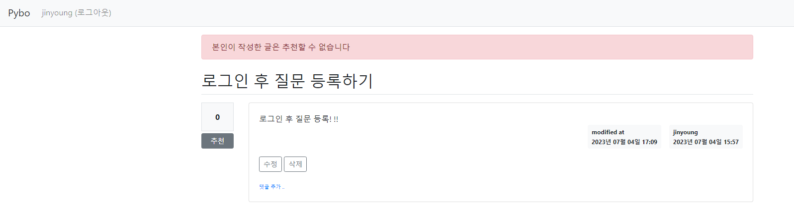
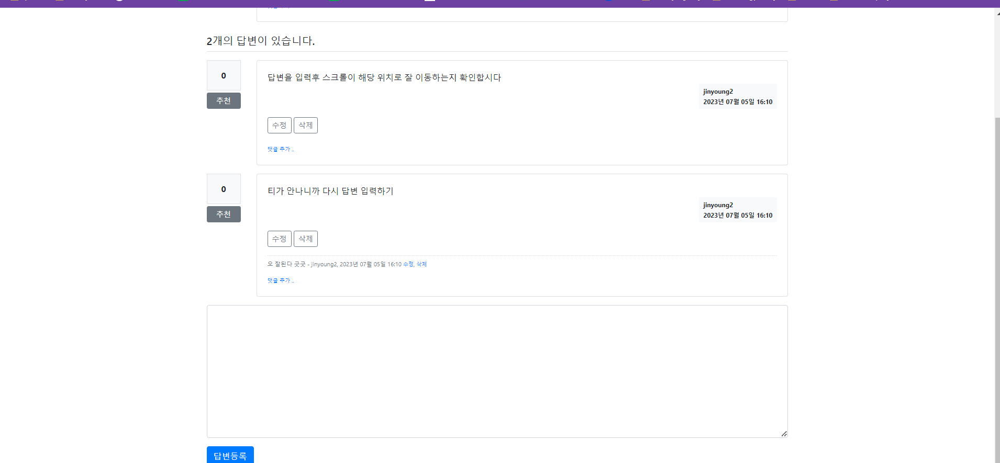
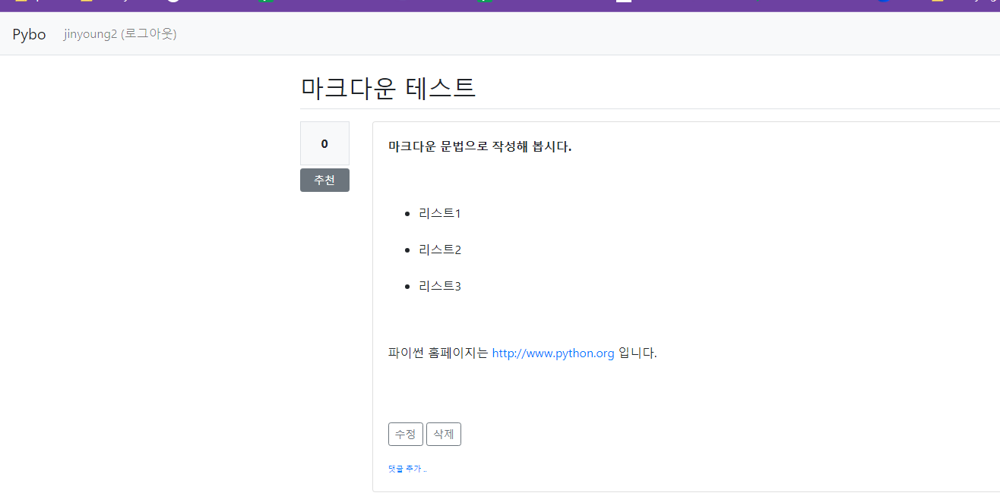
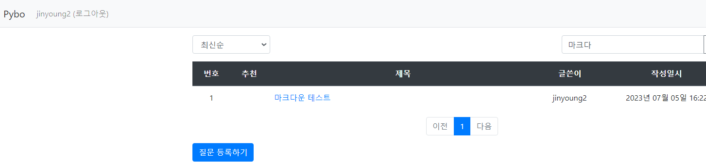
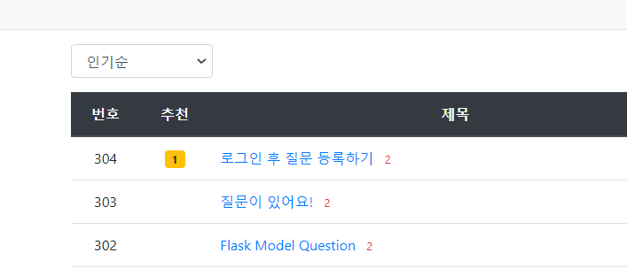

# CHAPTER 3 - 3 

## 3- 11. 댓글 기능 추가하기 
```python
class Comment(db.Model):
    id=db.Column(db.Integer, primary_key=True)
    user_id=db.Column(db.Integer, db.ForeignKey('user.id',ondelete='CASCADE'), nullable=False)
    user=db.relationship('User', backref=db.backref('comment_set'))
    content=db.Column(db.Text(),nullable=False)
    create_date=db.Column(db.DateTime(),nullable=False)
    modify_date=db.Column(db.DateTime())
    question_id=db.Column(db.Integer, db.ForeignKey('question.id',ondelete='CASCADE'),nullable=True)
    question=db.relationship('Question',backref=db.backref('comment_set'))
    answer_id=db.Column(db.Integer,db.ForeignKey('answer.id',ondelete='CASCADE'),nullable=True)
    answer=db.relationship('Answer',backref=db.backref('comment_set'))
```
* 질문 또는 답변을 데이터베이스에서 삭제 시 연관된 댓글도 삭제되도록 ondelete='CASCADE'로 작성함 

```python
class CommentForm(FlaskForm):
    content=TextAreaField('내용', validators=[DataRequired()])
```
* forms.py에 CommentForm 클래스를 추가함. 댓글은 content 필드 하나만 필요 

```python
from datetime import datetime

from flask import Blueprint, url_for, request, render_template, g
from werkzeug.utils import redirect

from pybo import db
from pybo.forms import CommentForm
from pybo.models import Question, Comment
from pybo.views.auth_views import login_required

bp=Blueprint('comment', __name__, url_prefix='/comment')

@bp.route('comment',__name__, url_prefix='/comment')
@login_required
def create_question(question_id):
    form=CommentForm()
    question=Question.query.get_or_404(question_id)
    if request.method=='POST' and form.validate_on_submit():
        comment=Comment(user=g.user, content=form.content.data, create_date=datetime.now(),question=question)
        db.session.add(comment)
        db.session.commit()
        return redirect(url_for('question.detail',question_id=question_id))
    return render_template('comment/comment_form.html',form=form)
```
* 질문 댓글 등록 함수. 
* 질문에 달린 댓글이므로 Comment 모델 객체를 생성할 때 question 필드에 값을 설정해야함 

```python
@bp.route('/modify/question/<int:comment_id>', methods=('GET','POST'))
@login_required
def modify_question(comment_id):
    comment=Comment.query.get_or_404(comment_id)
    if g.user !=comment.user:
        flash('수정권한이 없습니다')
        return redirect(url_for('question.detail'),question_id=comment.question.id)
    
    if request.method=='POST':
        form=CommentForm()
        if form.validate_on_submit():
            form.populate_obj(comment)
            comment.modify_date=datetime.now()
            db.session.commit()
            return redirect(url_for('question.detail'),question_id=comment.question.id)
    else:
        form=CommentForm(obj=comment)
    return render_template('comment/comment_form.html',form=form) 
```
* 댓글 수정. POST방식으로 요청 시 폼에서 수정한 내용으로 댓글을 업데이트하고, GET방식인 경우 기존 댓글을 조회하여 반환함 
```python
@bp.route('/delete/question/<int:comment_id>')
@login_required
def delete_question(comment_id):
    comment=Comment.query.get_or_404(comment_id)
    question_id=comment.question.id
    if g.user != comment.user:
        flash('삭제권한이 없습니다')
        return redirect(url_for('question.detail',question_id=question_id))
    db.session.delete(comment)
    db.session.commit()
    return redirect(url_for('question.detail',question_id=question_id))
```
* 댓글 삭제 

## 3-12. 추천 기능 추가하기 
* Question , Answer에 추천인이라는 필드를 추가
* 다대다 관계: 글 1개에 여러명이 추천할 수 있고, 반대로 1명이 여러 개의 글을 추천할 수 있으므로 -> Many to Many
```python
question_voter=db.Table(
    'question_voter',
    db.Column('user_id',db.Integer,db.ForeignKey('user.id',ondelete='CASCADE'),primary_key=True),
    db.Column('question_id',db.Integer,db.ForeignKey('question.id',ondelete='CASCADE'),primary_key=True)
)
```
* 다대다관계 적용 위해 계정과 질문이 한 쌍을 이루는 테이블 객체 question_voter를 생성 
    * 테이블 객체?: 다대다관계 정의 위해 db.Table 클래스로 정의되는 객체 
    * 여기서 question_voter 테이블 객체는 user_id와 question_id 모두 기본키이므로 다대다관계가 성립되는 테이블임 
```python
voter=db.relationship('User',secondary=question_voter,backref=db.backref('question_voter_set'))
```
* secondary 설정: 'voter가 다대다관계이며 question_voter 테이블을 참조한다'는 사실을 알려줌 
```python
from flask import Blueprint, url_for, flash, g
from werkzeug.utils import redirect

from pybo import db
from pybo.models import Question
from pybo.views.auth_views import login_required

bp=Blueprint('vote',__name__, url_prefix='/vote')

@bp.route('/question/<int:question_id>/')
@login_required
def question(question_id):
    _question=Question.query.get_or_404(question_id)
    if g.user==_question.user:
        flash('본인이 작성한 글은 추천할 수 없습니다')
    else:
        _question.voter.append(g.user)
        db.session.commit()
    return redirect(url_for('question.detail',question_id=question_id))
```
* append 함수로 추천인을 추가함 

```python
@bp.route('/answer/<int:answer_id>/')
@login_required
def answer(answer_id):
    _answer=Answer.query.get_or_404(answer_id)
    if g.user == _answer.user:
        flash('본인이 작성한 글은 추천할 수 없습니다')
    else:
        _answer.voter.append(g.user)
        db.session.commit()
    return redirect(url_for('question.detail',question_id=_answer.question.id))
```
* 답변 추천 함수도 같은 방식으로 구현하면 됨 

## 3-13. 스크롤 초기화 문제점 해결하기
* 앵커 엘리먼트로 원하는 위치로 스크롤을 이동시키기 
```html
<a name="answer_{{answer.id}}"></a>
``` 
* 앵커 엘리먼트로 이동할 수 있도록 redirect를 수정해야한다 
```python
return redirect('{}#answer_{}'.format(url_for('question.detail', question_id=question_id),answer.id))
```


## 3-14. 마크다운 기능 적용하기 
```python
    #markdown
    Markdown(app,extensions=['nl2br','fenced_code'])
```



## 3-15. 검색, 정렬 기능 추가하기 
* 조인: 같은 데이터로 연결된 두 모델을 함께 조회할 때 사용함 
* 검색 기능은 GET 방식으로 구현해야함 
    * 만약 POST방식으로 한다면, 중복을 방지하기 때문에 새로고침 또는 뒤로가기를 할 경우 만료된 페이지 오류가 발생할 수 있기 때문 
    * 정렬 기능 또한 GET방식으로 구현해야함 
```python
@bp.route('/list/')
def _list():
    # 입력 파라미터
    page = request.args.get('page', type=int, default=1)
    kw = request.args.get('kw', type=str, default='')

    # 조회
    question_list=Question.query.order_by(Question.create_date.desc())
    if kw:
        search = '%%{}%%'.format(kw)
        sub_query = db.session.query(Answer.question_id, Answer.content, User.username) \
            .join(User, Answer.user_id == User.id).subquery()
        question_list = question_list \
            .join(User) \
            .outerjoin(sub_query, sub_query.c.question_id == Question.id) \
            .filter(Question.subject.ilike(search) |  # 질문제목
                    Question.content.ilike(search) |  # 질문내용
                    User.username.ilike(search) |  # 질문작성자
                    sub_query.c.content.ilike(search) |  # 답변내용
                    sub_query.c.username.ilike(search)  # 답변작성자
                    ) \
            .distinct()

    # 페이징
    question_list = question_list.paginate(page=page, per_page=10)
    return render_template('question/question_list.html', question_list=question_list, page=page, kw=kw)
```


```python
#정렬
    if so == 'recommend':
        sub_query = db.session.query(question_voter.c.question_id, func.count('*').label('num_voter')) \
            .group_by(question_voter.c.question_id).subquery()
        question_list = Question.query \
            .outerjoin(sub_query, Question.id == sub_query.c.question_id) \
            .order_by(sub_query.c.num_voter.desc(), Question.create_date.desc())
    elif so == 'popular':
        sub_query = db.session.query(Answer.question_id, func.count('*').label('num_answer')) \
            .group_by(Answer.question_id).subquery()
        question_list = Question.query \
            .outerjoin(sub_query, Question.id == sub_query.c.question_id) \
            .order_by(sub_query.c.num_answer.desc(), Question.create_date.desc())
    else:  # 최근 질문
        question_list = Question.query.order_by(Question.create_date.desc())
```


---
추가로 만든 계정
jinyoung2
12345*